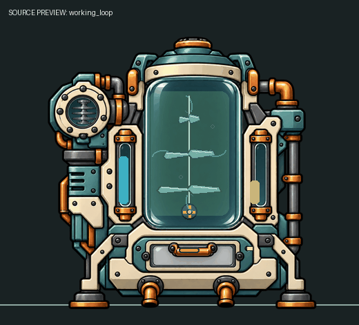

# 白夜生态培养仓 0.1.5

独立《缺氧：眼冒金星》模组，基于 U59-744825 API。不依赖白夜聚变模组，不增加世界生成要求。

## 下载与安装

当前开发安装包为 `dist/BaiyeEcologyCulture-0.1.5.zip`，无需自行编译。已公开版本从 [GitHub Releases](https://github.com/baiye-gift/BaiyeEcologyCulture/releases) 下载；0.1.5 尚未公开发布。0.1.3 有配置侧栏布局问题，0.1.4 的布局诊断会在隐藏面板上启动协程而报错，请升级。

1. 保存并完全退出游戏，升级前备份存档与旧模组。
2. 解压后将整个 `BaiyeEcologyCulture` 文件夹放入系统“文档”目录的 `Klei/OxygenNotIncluded/mods/local/`；不要嵌套额外目录，也不要将备份留在该扫描目录。
3. 在模组页启用“白夜生态培养仓”，按游戏提示重启；启用《眼冒金星》。
4. 食物菜单建造，FoodRepurposing 科技解锁（该科技不存在时归入 Agriculture）。玩法与验证范围见下文，版本记录见 [CHANGELOG](CHANGELOG.md)。



上图是固定示例库存的动画源预览，不是游戏实机录像。

## 建筑与操作

4×4 **生态培养仓**，食物菜单；`FoodRepurposing` 科技解锁（该科技不存在时归入 Agriculture）。800 kg 精炼金属。

只需 **水/盐水输入、电力、有机营养料**；净氧气经独立气体口输出。水入口和氧出口保持旧版位置，分别为底部偏移 `(-1,0)`、`(1,0)`。不再需要 CO₂ 输入管和清洗排液管。

1. 输入水或盐水、接入电力，在建筑的 **配置 → 培养设置** 选择菌泥或污染土作为配送营养料。两种已入仓的原料都能使用；切换配送种类不删除原料。初始为保种策略、基础绿藻，2 kg 接种生物量需实际材料和约 120 秒付费培养。
2. 主界面只有 **培养策略、培养种类、营养料** 三个原生下拉选择。策略立即切换；选择不同种类默认基础性状，并出现 **开始换种**，点击才回收旧母株。当前实际培养株始终单独显示，未执行的选择不会改名库存。
3. **高级设置** 默认折叠，长内容可滚动，包含接种性状、换种保样、独立采样目标/任务、详细数据。接种性状与采样目标互不影响。采样不足健康/母株/经历时显示具体原因和筛选条件；已安排任务可取消。展开详细数据可看库存、近 5 秒产率和经历。侧栏只挂在原生配置内容区，不向全局详情布局添加临时模板。
4. 每次采收 4 kg 真实生物量后，成品及副产物整批排到建筑底部或侧面空格。复制人按储物箱/冰箱/厨房任务取用，清扫器按范围搬运；没有搬运目的地时不会凭空安排搬运任务。食品需及时冷藏。母株、水与营养料留仓，不逐帧掉小块。非采收盐/残渣约 5 kg 一批，换种阶段结束排出余量；真实样本生成后排出。
5. 更换流程：可选保留 50 g 真实样本 → 回收旧培养物 → 仓内过滤盐水并留下真实盐 → 用至少 **0.6 kg 仓内水进行 30 秒循环清洗** → 接种新株。清洗不消耗或外排这份循环水，也不自动删除病菌。特殊株需配送相同种类、性状的真实样本，样本只转入母株一次。
6. 产物仓不足下一批 4 kg 时，在水、营养料、温度正常且实际付费的条件下以 **120 W 保种维护**；停止增长/产氧，维持原健康，不因堵仓失活。空间恢复后自动继续原策略。清洗和回收仍需 480 W。出料格被砖块占据时保留库存并显示建筑警告。
7. **排出暂存产物** 一次排出成品、副产物及样本，不能排出母株/水/营养料。升级首次加载会尝试排出旧积压库存；新批次未满的副产物之后保留跨读档。失活时点击 **清洗并重新接种基础株**，无需特殊样本；旧失活生物量按残渣真实回收。缺水/缺料/缺电/温度异常与失活显示图标、处理指引；健康下降和失活各只通知一次，恢复后可再次提醒。旧存档未记录的失活原因不会被猜测。
8. **特殊株样本不会天然生成。** 例如“基础绿藻·高营养株样本”：先培养普通基础绿藻，在有机营养料库存至少 10 kg 时累计 1800 秒实际付费培养，然后在高级设置选择高营养株采样并安排复制人工作。30 秒采样消耗 50 g 真实母株，产出样本供同种仓接种。采收、保种维持、堵仓维护和停机不累计筛选经历，因此总经过时间通常超过 3 周期。缺样本且已经进入特殊株接种时，可点击 **回收清洗并退回基础株**；它回收当前实际母株、重新清洗，再用水和营养料培养目标藻类的基础株，已配送样本留仓，不会自动转成普通母株。

## CO₂：可选环境增速

建筑付费运行时，使用原版 `ElementConsumer` 从采样点（建筑基点上方一格）周围 3 格范围吸收真实 CO₂，最多 250 g/s，缓存 5 kg。不会隔空创造 CO₂；无电或未获得近期运行付款时不吸收。

- **无 CO₂：** 有机营养料和水维持基础生长、自动采收；不产生净氧气。
- **有 CO₂：** 在基础生长上增加光合作用，消耗实际 CO₂、水及矿物养分，同时增加生物量和净氧气。额外生长上限为基础生长的 100%（供氧）、50%（食物）、25%（保种），实际受可用材料、母株容量与出口空间限制。
- 氧缓存满只暂停光合增速，基础培养继续；没有有机营养料或水则不能基础培养。
- 老版本的肥料库存仍可供光合增速使用，但不再作为必须配送的材料。它只有矿物作用，不能单独制造有机生物量。

## 三种藻类与策略

| 培养物 | 满密度基础生长上限 | 采收结果 | 温度范围 |
|---|---:|---|---:|
| 基础绿藻 | 160 g/s | 原版藻类，不是食物 | 10–40°C |
| 螺旋藻 | 3 g/s | 80% 螺旋藻泥、20% 不可食残渣 | 20–38°C |
| 盐生藻 | 4 g/s | 65% 盐生藻叶、35% 不可食残渣；使用盐水时另收集盐 | 15–42°C |

| 策略 | 保留母株 | 门槛 / 自动采收 | 培养耗电 |
|---|---:|---|---:|
| 保种 | 12 kg | 培养至 16 kg，维持；不自动采收 | 120 W |
| 供氧优先 | 14 kg | 达 18 kg 后采收 4 kg 生物量 | 960 W |
| 食物优先 | 8 kg | 达 12 kg 后采收 4 kg 生物量 | 600 W |

表中基础上限还受密度、拥挤、健康、策略和性状影响。保种生长倍率 0.35，食物 0.9。母株容量 20 kg，营养料 20 kg，水 40 kg，产物 50 kg，气体各 5 kg，样本 0.5 kg。接种、清洗与换种耗电 480 W。实际产率为近 5 秒平均；健康下降会把部分可食产物变为真实残渣。

断电、缺少水或有机营养料、温度不适会逐渐降低健康；从满健康到失活阈值约 3.6 周期。无 CO₂ 或单纯堵仓不降低健康。健康达到 10% 或更低后停止生产，需重新接种，不能自动复活；失活和未完成接种的培养物只回收残渣。正常生产可恢复尚未失活的培养物，120 W 堵仓维护只维持原健康。本版使用聚合健康模型，未模拟逐细胞呼吸。

## 数据库指南与运行动画

建筑数据库的原生条目新增连接启动、两条培养路径、三策略、藻类食品、换种样本、状态排查六组指南；7 种食物、15 种样本、3 种活体及残渣各有用途说明。数据库扩展保留原生和其他模组的条目内容与 ID，重复调用不会重复登记。

新外壳窗口为清澈均匀培养液，三藻类分别柔绿、蓝绿、淡橄榄色；健康异常显示警示灯。旋转搅拌轴叶片、机械泵与循环液流持续运行，区分启动、接种、培养、缓速保种、实际自动采收、过滤清洗和停机。采收动作只跟随已提交的真实自动采收；预检和人工采样不会触发。中央浓度及水/产物计量仍跟随真实库存。

内部代谢合并到培养效率、耗电和健康中，只核算仓外净收支；基础有机培养与额外光合增产分别表述，不声称所有生长是光合作用或已逐步模拟呼吸。

## 真实质量账目与游戏抽象

**基础生长：** 每 1 kg 新增含水生物量消耗 **0.8 kg 有机培养基 + 0.2 kg 水**，不产生净氧气。

**额外光合生长：** 每 1 kg 光合新增生物量消耗 **1.437333 kg CO₂ + 0.588 kg 水 + 0.02 kg 矿物养分**，产生 **1.045333 kg 氧气**。旧版肥料可直接供应养分；没有肥料时，游戏培养基按 20% 可用矿物组分折算，需要 **0.1 kg 有机培养基**，其余 **0.08 kg** 成为真实残渣。速生/高营养株的额外矿物需求也产生等量残渣。

盐水按原版 93% 水、7% 盐核算，盐不消失。每笔事务先核对所有真实输入和输出空间，再统一扣料与入仓；收获消耗实际母株生物量。没有完整运行付款时不生产或推进清洗。

有机培养基配比及含水生物量是游戏平衡抽象，代表经过仓内处理的碳源与矿物培养液，不声称所有藻类能直接吃未经处理的菌泥或污染土。光合部分以 CH₂O 等效物核算；不把两种生长模式都称为同样的干重。复制人呼出的少量 CO₂ 通常不足以提供持续的大规模供氧，食用株的氧气是副产物。食物热量与灯光效率为游戏尺度；运行电力释放为建筑热量，仍须保持适合的温度。

## 0.1.0 存档升级

九个原生仓的位置、物品 ID、培养阶段编号保持不变。已有培养株、样本、产物及缓存材料保留；旧排液仓的水会在付费运行、输入仓有空间时逐步回收，盐水回收时真实分离盐。旧肥料保留临时独立容量额度，避免堵住新有机营养料配送；光合增速可逐步消耗，也可手动取走。

修复 BiggerCapacity 将本建筑所有仓放大 10000 倍的问题：功能容量使用本建筑自身限值；旧超量库存不裁剪，有空位前停止新增对应库存。显示层封顶，不因旧超量材料越界。旧 CO₂ 输入、排液输出处的管道可以拆掉，两个仍保留的管口无需重新定位。

## 性状、保种与采样

每台仓只保留一个当前性状。新性状来自对应条件下 **1800 秒实际生长经历**，再安排复制人进行 30 秒采样工作；技能只改变工作时间，不增加产物。采样消耗 50 g 母株，不能突破母株保留量；新性状的累计经历在取样后清零。样本有 15 个独立原生物品 ID，种类和性状不会因切换策略而改变。

| 性状 | 筛选条件 | 取舍 |
|---|---|---|
| 基础株 | 无额外经历 | 标准参数 |
| 耐热株 | ≥34°C 实际培养 | 温度上限 +12°C；生长 ×0.85 |
| 低耗株 | 保种模式实际培养 | 培养电力及生长 ×0.65，体现较低照明需求 |
| 速生株 | 食物模式实际培养 | 生长 ×1.25；光合矿物养分 ×1.25，额外矿物进入残渣 |
| 高营养株 | 有机营养料库存 ≥10 kg 时实际培养 | 可食比例 +15 个百分点；生长 ×0.95、光合矿物养分 ×1.25 |

样本为封装种质，未添加腐败机制；食材和成品使用原版新鲜度、病菌及冷藏机制。特殊株灭失且没有样本时，需要重新筛选；基础种质库不会恢复特殊性状。培养残渣可送原版堆肥堆。拆除会释放真实库存，活体专用材料不能直接食用。

## 原版厨房食谱

| 菜品 | 每批投入 | 每批质量 / 热量 | 品质 / 厨房 |
|---|---|---:|---|
| 藻泥粥 | 1 kg 螺旋藻泥 + 0.5 kg 水 | 1.5 kg / 4000 kcal | 0，食物压制器 |
| 藻麦饼 | 1 kg 螺旋藻泥 + 0.25 kg 冰霜麦粒 | 1.25 kg / 4100 kcal | 1，电动烤炉 |
| 盐藻脆片 | 1 kg 盐生藻叶 | 1 kg / 2000 kcal | 1，电动烤炉 |
| 菌菇藻卷 | 1 kg 煎蘑菇 + 0.5 kg 盐生藻叶 + 0.25 kg 螺旋藻泥 | 1.75 kg / 4800 kcal | 3，燃气灶 |
| 藻酱豆腐 | 1 kg 豆腐 + 0.5 kg 螺旋藻泥 + 0.25 kg 盐生藻叶 | 1.75 kg / 6100 kcal | 4，燃气灶 |

螺旋藻泥 4000 kcal/kg、品质 -1；盐生藻叶 2000 kcal/kg、品质 0；原料基础腐败时间 2 周期，熟食 6 周期。水不提供热量；藻麦饼的谷物烹熟贡献按 400 kcal/kg 的游戏配方折算。新配方不覆盖原版 ID，全部产品质量等于投入质量。

## 构建与验证

需要 .NET 8 SDK、已安装的游戏以及带 Pillow 的 Python（仅重建/校验美术时需要）。仓库包含自有 KAnim、完整 SCML/原图与提示词，不下载或分发游戏 DLL。独立构建时在仓库根目录执行，并按 Steam 库调整路径：

```powershell
$gameManaged = 'D:\Steam\steamapps\common\OxygenNotIncluded\OxygenNotIncluded_Data\Managed'
$modDirectory = Join-Path ([Environment]::GetFolderPath('MyDocuments')) 'Klei/OxygenNotIncluded/mods/local/BaiyeEcologyCulture'
./tools/build-package.ps1 -GameManaged $gameManaged -InstallTo $modDirectory
```

只打包时省略 `-InstallTo`。构建产物与版本 ZIP 在 `dist/`；安装脚本在游戏运行时拒绝覆盖，退出后先备份到项目 `dist/install-backups/`，再逐文件核对 SHA-256。测试项目也可传入 `-p:GameManaged=<路径>`。

- `dotnet run --project tests/Regression/Regression.csproj -c Release`：50 项实际生产/活动/批次回归，包括十周期堵仓、实际付款与恢复、特殊株接种退出、真实高营养样本取得与一次接种。
- `dotnet build EcologyCulture.csproj -c Release`：游戏 U59 原生 API 编译。
- `dotnet run --project tests/NativeContract/NativeContract.csproj -c Release -- <游戏 Managed 目录>`：8 项原生托管检查：KSerialization 状态/历史原因往返、保存接口、15 种样本 ID、原生侧栏类型、配置注册保留原有条目/单实例/幂等、可识别分类、库存顺序和厨房配方。
- `python tools/build-anims.py --kanimal <kanimal-cli.exe>`：透明源图与原生动态层编译。
- `python tools/verify-assets.py`：10 套资源引用、实际原生阶段名、机械/液流运动、均匀浓度、128 px 图标、2048 px 图集上限及各阶段源预览。
- `dotnet run --project tests/NativeCodex -c Release -- <游戏 Managed 目录>`：4 项独立原生 Codex 托管检查；先编译本项目，无需核子工艺。测试不实例化 Unity 数据库界面。
- `powershell -File tools/build-package.ps1`：发布目录和 ZIP；可选 `-InstallTo`，游戏运行时会拒绝覆盖。

离线测试及原生托管序列化并不等于完整游戏保存恢复验证。首次安装需要启用；已启用者重启游戏后在沙盒核对两口、培养设置点击及自动启用、环境 CO₂ 吸收、人工配送/清扫器搬运、食谱、工作动画和保存读档；多模组兼容及长时间运行尚待实机测试。

核子工艺另见 [BaiyeFusionPower](https://github.com/baiye-gift/BaiyeFusionPower)。两模组可分别安装，也可一起使用。
